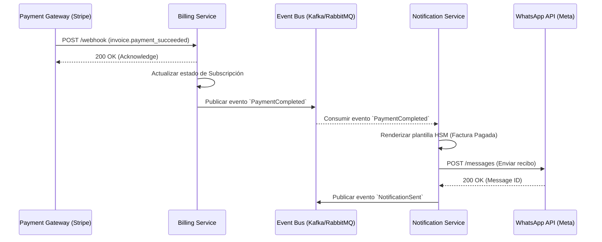

# Flujo del Bus de Eventos Asíncrono (Event-Driven Architecture)

La infraestructura backend opera bajo un paradigma orientado a eventos. Esto desacopla el dominio de facturación del dominio de notificaciones, asegurando una resiliencia de nivel corporativo ante picos de tráfico.

## 1. Coreografía: Del Pago Exitoso a la Notificación

Cuando Stripe o MercadoPago emiten un webhook de pago exitoso, el sistema no bloquea el hilo para enviar el mensaje. En su lugar, el `Billing Service` publica un evento en el bus (ej. RabbitMQ o Kafka), que luego es consumido asíncronamente por el `Notification Service`.

## 2. Estrategia de Circuit Breakers (Cortocircuitos)
Si la API de WhatsApp experimenta caídas (latencia > 5s o códigos HTTP 5xx), el `Notification Service` abre su *Circuit Breaker*. En lugar de colapsar intentando enviar mensajes, los encola en una `Dead Letter Queue` (DLQ) para reintentos con retraso exponencial (Exponential Backoff), garantizando tolerancia a fallos.
