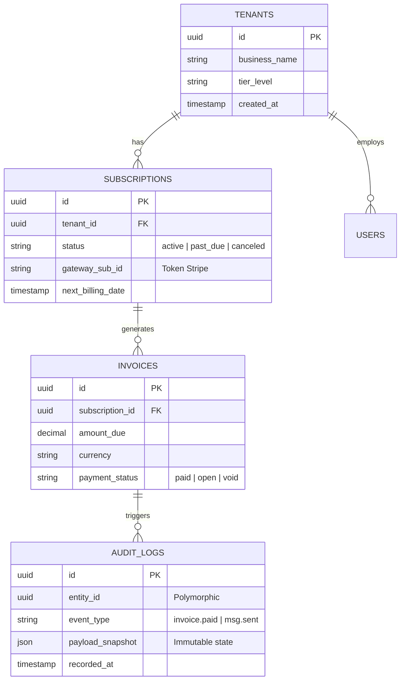

# Esquemas de Base de Datos y Trazabilidad (Mocks)

La persistencia de datos sigue reglas de diseño *Multi-Tenant* e inmutabilidad estricta. Todo evento financiero se respalda en tablas de solo inserción (Append-Only) para generar un *Audit Trail* robusto.

## 1. Diagrama Entidad-Relación (Mermaid ERD)
*Todos los nombres, IDs y atributos mostrados representan la arquitectura, no datos reales de clientes.*

## 2. Inmutabilidad y Audit Logs
La tabla `AUDIT_LOGS` está estructurada para cumplir con normativas de auditoría financiera (ej. SOX compliance adaptado). No se permiten operaciones `UPDATE` o `DELETE` sobre estos registros. Cualquier modificación en un `INVOICE` requiere la creación de un nuevo registro correctivo (Nota de Crédito) y un nuevo *Audit Log*.
